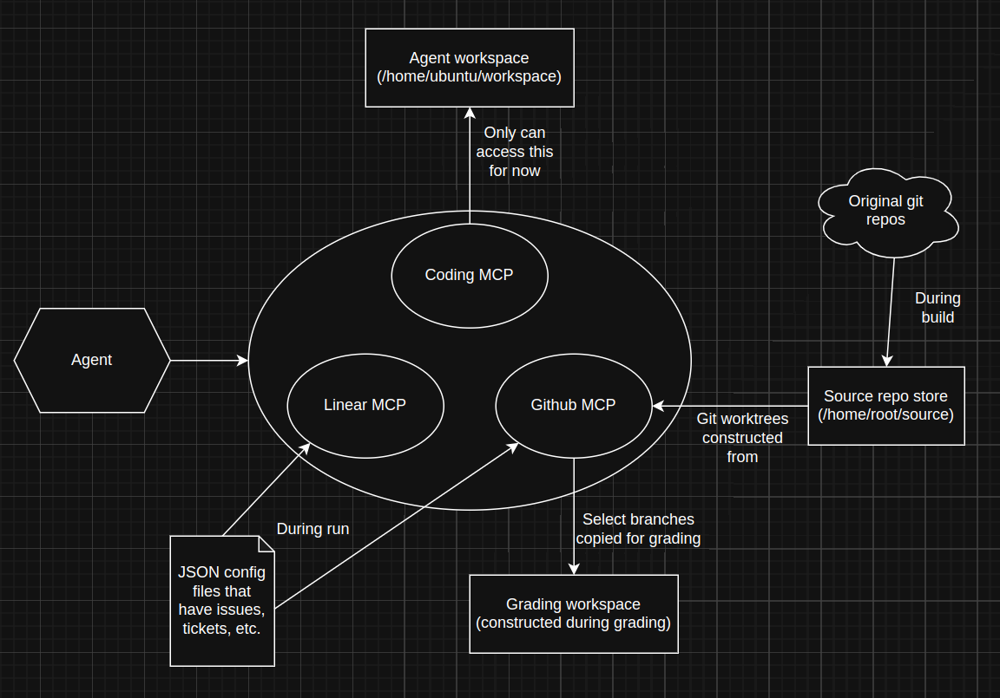

# SDLC Template

HUD environment template for SDLC evaluation tasks.



## Setup

1. Copy `.env.example` to `.env` and fill in your `LIB_GITHUB_PAT`, `SOURCE_GITHUB_PAT` (needed if any source repos are private), and `HUD_API_KEY`.
2. Install dependencies:

```bash
uv sync
```

## Commands

All commands read configuration from `.env` automatically.

| Command | Description |
|---|---|
| `uv run build` | Build the Docker image locally (passes PAT as a build secret) |
| `uv run deploy` | Build and deploy the environment to HUD (passes PAT as a build secret) |
| `uv run update-sdlc` | Update `hud-sdlc-lib` to the latest commit and re-lock. Run automatically before `uv run build` as well. |
| `uv run sync-tasks --taskset <name-or-id> --env <env-name>` | Sync local `tasks/` into a platform taskset using API-key-compatible endpoints. |

Extra flags are forwarded, e.g. `uv run build --no-cache`.

### Syncing tasks to a taskset

After deploying your environment, you can sync local task definitions directly to a HUD taskset:

```bash
# Preview changes only
uv run sync-tasks --taskset "SDLC Bugs" --env my-sdlc-env --dry-run

# Apply changes
uv run sync-tasks --taskset "SDLC Bugs" --env my-sdlc-env
```

Notes:
- Every task must have a stable ID via `task.slug` (for example, `task.slug = "basic"`).
- Unchanged tasks (same scenario + args) are skipped client-side.
- New + changed tasks are uploaded in one `/tasks/upload` batch call.
- Platform-only task edits are preserved unless you upload the same slug from local.
- If the taskset does not exist yet, it is created automatically on first sync.
- `env.name` is required by `/tasks/upload`; pass `--env` (or set `ENV_NAME`) to the deployed environment name.

## Adding scenarios

Create a new file in `tasks/` and register it in `tasks/__init__.py`:

```python
# tasks/my_task.py
from env import env

@env.scenario()
async def my_task():
    answer = yield "Your prompt here"
    yield 1.0  # reward
```

```python
# tasks/__init__.py
import tasks.basic  # noqa: F401
import tasks.my_task  # noqa: F401
```

## Updating hud-sdlc-lib

```bash
uv run update-sdlc
```

This fetches the latest commit from the private repo, updates `uv.lock`, and installs it locally. To do this, you'll need to use a PAT that has access to [hud-sdlc-lib](https://github.com/hud-evals/hud-sdlc-lib). If you need this PAT, reach out to your HUD contact.
